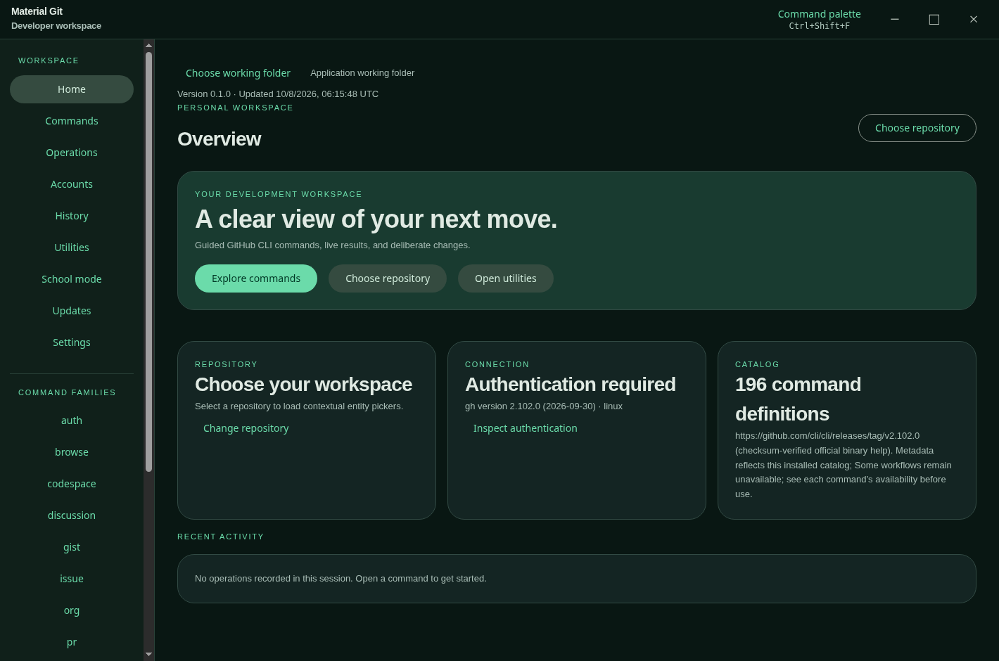

# Material Git

A desktop workspace that turns GitHub CLI commands into guided Material Design controls.

Material Git is an early implementation, **not complete GitHub CLI GUI parity**. The pinned GitHub CLI 2.102.0 catalog contains 196 command definitions: 181 have structured dispatch and 15 need dedicated workflows. These are coverage counts, not a claim that every command has passed live integration testing. See [command coverage](docs/command-coverage.md) and [remaining work](docs/verification-gaps.md).



Captured from the Linux development build, with no account connected.

## Use

Download the latest unsigned Windows `Setup.exe` from [Releases](https://github.com/Ding-Ding-Projects/material-git/releases). GitHub CLI and MinGit are bundled. Sign in on the Accounts screen, select a repository, then open a command. Lists offer guided choices and pagination; changes show a review before execution. Windows may show an unknown-publisher prompt.

[Documentation site](https://material-git.earlyray.chatgpt.site) — currently owner-private. Updating the repository About homepage is blocked by the connected credential’s metadata permission (HTTP 403). The desired homepage is the documentation URL above. Site audience is managed separately from this public source repository.

## Included

- Official Material Web controls, dynamic themes, animated transitions and reduced motion.
- Command catalog, entity pickers, structured flags, JSON-field chips, live operation output, cancellation, results and exports.
- Device-flow account sign-in and reviewed account changes without displaying stored tokens.
- English/Cantonese presentation settings, installed-voice narration, local vocabulary import, access preferences and encrypted local TOTP where supported by the operating system.
- Isolated regex workbench, local text/colour/time/unit converters, and local Ollama models and chat.
- Unsigned Windows Squirrel installation and update feed, with restart kept explicit.

## Develop

Use Node.js 22.20 or newer. Linux and macOS source runs need a compatible system Git and Electron desktop libraries. Windows scripts bootstrap a verified local Node runtime without administrator rights.

```sh
npm ci
npm run fetch-dependencies
npm run check
npm test
npm run dev
```

`npm run build` produces the application bundle. `node scripts/build-site.mjs` builds the documentation. On Windows, `build.bat /s` builds and `build-installer.bat /s` creates `Setup.exe`, `RELEASES`, a full NuGet package and SHA-256 sums. On a network proxy, Electron’s lazy installation may require the Node environment-proxy setting.

The Windows workflow only builds, packages and publishes. Type checks and behavioral tests run locally. Linux headless interaction checks do not establish Windows installer, update, secure-storage or full command parity.

## Design and boundaries

The renderer has no Node integration. Validated IPC invokes pinned executables using argument arrays with `shell: false`. Operations retain bounded, redacted output. Personal vocabulary remains local and is omitted from history and exports. Reviewed local Git commands can use the hooks and helpers configured in the working folder you choose.

See [Material provenance](design/material-provenance.md), [personalization](docs/personalization.md), [converters](docs/converters.md), [local models](docs/ollama.md), and [verification gaps](docs/verification-gaps.md).
